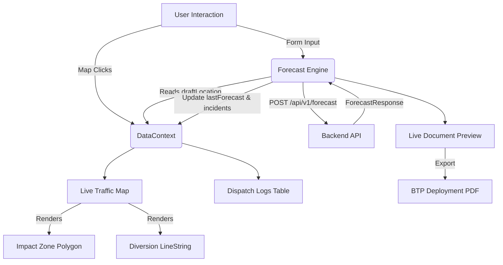

# Bengaluru Traffic Police (BTP) Command Center — Frontend


> **Tactical operations terminal for the Bengaluru Traffic Police Predictive Traffic Management System.**  
> Built for the Flipkart Grid 2.0 (Round 2) Hackathon.

---

## 📖 Executive Summary

The **BTP Command Center** is the operator-facing dashboard that surfaces real-time predictions and deployment recommendations generated by the [Backend AI Engine](https://github.com/Aatraya/gridlock2-round2). 

Designed as a high-performance tactical UI, it provides dispatchers with an interactive live traffic map, a predictive AI forecast engine, and automated PDF deployment orders. By centralizing spatial intelligence and manpower recommendations into a single dark-mode dashboard, it allows traffic authorities to rapidly mitigate the impact of urban incidents.

---

## 🏗 System Architecture

The frontend follows a modern, decoupled React architecture utilizing a global `DataContext` to ensure perfectly synchronized state across all dashboard widgets without prop-drilling.



### Directory Structure
```text
src/
├── app/
│   ├── layout.tsx                  # Root layout: DataProvider, Toaster
│   └── (dashboard)/                # Dashboard Route Group
│       ├── map/page.tsx            # Live Traffic Map interface
│       ├── generator/page.tsx      # Forecast Engine & PDF export
│       └── warrants/page.tsx       # Active Dispatch Logs & Statistics
├── components/
│   ├── layout/Navigation.tsx       # Responsive Sidebar Navigation
│   ├── map/MapWidget.tsx           # Client-side Leaflet mapping engine
│   └── generator/                  # Predictive forms and live PDF renderers
├── context/
│   └── DataContext.tsx             # Global State Management Source of Truth
├── lib/
│   └── mockBTPData.ts              # Seed data for initial dashboard state
└── types/
    └── forecast.ts                 # TypeScript schemas synced with Backend Pydantic models
```

---

## 🚀 Key Technical Highlights

### 1. Advanced Client-Side Mapping
The `/map` view utilizes `Leaflet` and `react-leaflet`, strictly loaded on the client-side (`ssr: false`) to avoid server-rendering hydration conflicts. It features **Click-to-locate** functionality—clicking the map instantly sets a global coordinate state that auto-fills the Forecast Engine. Post-prediction, it overlays spatial impact zones (Red Dashed Polygons) and OSRM diversion routes (Green LineStrings).

### 2. Live Document Preview & Export
The Forecast Engine features a split-pane layout rendering a high-fidelity **BTP Deployment Order** in real-time as data arrives from the backend. Operators can export this document instantly via a one-click PDF generation engine (`html2canvas` at 2x resolution + `jsPDF`), complete with Web Audio API confirmation beeps.

### 3. Tactical Aesthetic & Animation
The UI is strictly designed for operational clarity. It employs a dark tactical color palette (`--bg-base` deep navy), monospace typography for all identifiers, and fluid motion (`framer-motion` `AnimatePresence`) for table rows and toast notifications (`sonner`).

### 4. Seamless Data Synchronization
`DataContext` is the single source of truth. When a forecast is successfully generated, it is stored centrally. The map immediately updates its GeoJSON overlays, the dispatch table adds a new row, and the preview updates—all completely synchronized.

---

## 🛠 Tech Stack

- **Framework**: Next.js 16 (App Router)
- **Language**: TypeScript 6
- **Styling**: Tailwind CSS v4
- **Mapping Engine**: Leaflet & react-leaflet
- **Visualizations & Motion**: Recharts & Framer Motion
- **PDF Generation**: html2canvas & jsPDF

---

## ⚙️ Environment Setup & Installation

### Prerequisites
- Node.js 18 or higher
- Running instance of the Backend Server (Local or Remote)

### Local Development Quickstart

1. **Install dependencies:**
   ```bash
   npm install
   ```

2. **Configure Environment:**
   Create a `.env.local` file in the root directory:
   ```env
   # Local Backend API
   NEXT_PUBLIC_API_URL=http://localhost:8000
   
   # Production Backend API (Optional)
   # NEXT_PUBLIC_API_URL=https://btp-backend-geo.onrender.com
   ```

3. **Start the development server:**
   ```bash
   npm run dev
   ```
   The application will be available at `http://localhost:3000`.

### Production Build
```bash
npm run build
npm run start
```

---

## 📡 Backend Data Integration

The frontend strictly types API responses to match the backend's Pydantic validation schemas. 

**`ForecastResponse` Object:**
```typescript
{
  event_id: string;
  cause: string;
  location: {
    lat: number;
    lng: number;
    address: string;
  };
  predictions: {
    estimated_duration_mins: number;
    severity_level: "LOW" | "MODERATE" | "HIGH" | "CRITICAL";
  };
  deployment_recommendation: {
    traffic_cops_needed: number;
    barricades: number;
    cranes: number;
    diversion_route: string;
    diversion_geometry: GeoJsonLineString | null;
    needs_backup: boolean;
    responding_station: string;
  };
  spatial_impact_geojson: GeoJsonPolygon | null;
}
```
*Note: The frontend now dynamically utilizes the `needs_backup` and `responding_station` properties autonomously calculated by the backend's spatial engine, removing manual dropdowns for precise operational accuracy.*

---

## 👥 Contributors

- **Amogh Gurudatta** — Frontend Engineering & UI/UX Integration
- **Aatraya Mukherjee** — Geospatial Engineering & Core Backend
- **Aryan** — Predictive Engine & Machine Learning Pipeline

_Copyright © 2026. Licensed under the MIT License._
